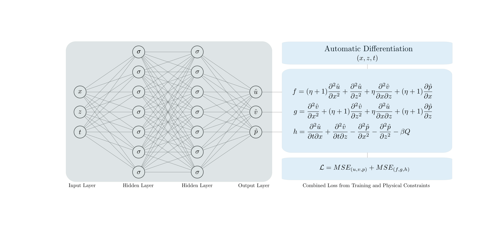

# Physics-informed Deep Learning for Flow and Deformation in Poroelastic Media
A physics-informed neural network is presented for poroelastic problems with coupled flow and deformation processes. The governing equilibrium and mass balance equations are discussed and specific derivations for two-dimensional cases are presented. A fully-connected deep neural network is used for training. Barry and Mercer's source problem with time-dependent fluid injection/extraction in an idealized poroelastic medium, which has an exact analytical solution, is used as a numerical example. A random sample from the analytical solution is used as training data and the performance of the model is tested by predicting the solution on the entire domain after training. The deep learning model predicts the horizontal and vertical deformations well while the error in the predicted pore pressure predictions is slightly higher because of the sparsity of the pore pressure values.

